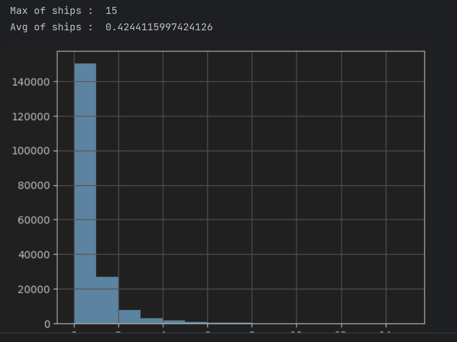

# Airbus Ship Detection Challenge

This repository is the solution for [Kaggle's Airbus Ship Detection Challenge](https://www.kaggle.com/competitions/airbus-ship-detection/overview).

The goal of the competition is to analyze satellite images of container ships and produce segmentation masks of the ships.
The training and test [datasets](https://www.kaggle.com/competitions/airbus-ship-detection/data) were obtained from the competition page.

The main solution is concentrated in train.ipynb, where the solution is well-structured, explained, and commented, along with visual comparisons and plots for better understanding and clarity according to the logic.

### Challenges involved:

* The dataset is heavily imbalanced. The vast majority of the images have no ships in them (150000 empty images from 192556 total images)


* Many ships are very small, and It is easy to miss them, and the model can also achieve high prediction accuracy by considering images with small ships as background. This is where the loss function comes in to help us. Additionally, the model can mistake sea distortions (waves) for ships.


* Ships can be located near piers and docks, which can also be considered as ships. Similarly, ships located close to each other can be merged into a single object.

## Tools

* [U-Net](https://arxiv.org/pdf/1505.04597.pdf) - Convolutional Neural Network (CNN) for the segmentation of biomedical images, aiming for highly accurate segmentation of small objects.


* [TensorFlow Keras](https://keras.io/api/)


* Python ofc.

## Installation

The steps to run it locally are as follows:

1. Navigate to the folder on your computer where you want to clone the project.


2. Execute the following command:
```shell
git clone https://github.com/VladyslavCherkashyn/Airbus_Ship_Detection_Challenge.git
```


3. Change into the cloned project directory:
```shell
cd Airbus_Ship_Detection_Challenge
```


4. Install the dependencies:
```shell
pip install -r requirements.txt
```


5. You will also need a [dataset](https://www.kaggle.com/competitions/airbus-ship-detection/data) for testing the trained model.
Unpack the downloaded data into a before created directory with the "airbus-ship-detection" name.


## Solution

### First, let's analyze the acquired dataset. (Exploratory Data Analysis)

Let's see how many images contain ships and how many images do not.

I iterated through the column and determined which values in the DataFrame are filled (True) and empty (False).

Let`s take a look at the number of unique images containing non-empty masks and at the number of blank images and the total number of images:
    

Let's convert the RLE strings (ship segmentations) into a unified mask, where ones represent segmented regions of ships and zeros represent the background. We will use the functions rle_decode() and masks_as_image() for this purpose.

Above, we have observed that the dataset is imbalanced (150000 empty images from 192556 total images).
    Also, some images may contain multiple ships:
    

A histogram will visually demonstrate this imbalance ratio:
    

So, let's create a balanced dataset for model training. And for comparison, let's look at the balanced DataFrame:
    

### Now we can split the sorted DataFrame into two DataFrames for model training (training and validation):
```python
train_ids, valid_ids = train_test_split(balanced_train_df,
                 test_size = 0.2,
                 stratify = balanced_train_df['ships'])
train_df = pd.merge(segmented_ships, train_ids)
valid_df = pd.merge(segmented_ships, valid_ids)
```
If we are dealing with a large dataset during model training, it is better to use batched data for greater efficiency. We can generate batches of images and masks using the function make_image_gen(). Let's examine the input images and their masks (size, minimum and maximum pixel values):


I will check the sizes of the validation data and their corresponding masks. This will help ensure that the data has been properly prepared and is ready for use in the model validation process


We also need to improve the generalization capability of the model and increase the diversity of data. For this purpose, I utilized the ImageDataGenerator.

### Segmentation model
The difficulty in segmentation happens on the boundaries.
To push the model towards paying attention to the boundaries, we add [Dice Loss coefficient](https://medium.com/ai-salon/understanding-dice-loss-for-crisp-boundary-detection-bb30c2e5f62b) to the loss function. The dice score looks at how similar the predicted mask is to the target mask by looking at the ratio of true positives to true positives plus false positives plus false negatives.


Additionally, we want to address the issue of small ships being mistakenly classified as empty by the model when predicting on images.
The solution to these issues is to employ [Focal Loss](https://towardsdatascience.com/focal-loss-a-better-alternative-for-cross-entropy-1d073d92d075), a version of cross entropy shown to improve classification of small objects.


Three callbacks to be used during the training of a segmentation model:
* ModelCheckpoint - saves the weights of the model with the best validation dice coefficient
* ReduceLROnPlateau - reduces the learning rate when the validation dice coefficient stops improving
* EarlyStopping - stops the training if the validation dice coefficient does not improve after a certain number of epochs

We will also use the fit() function to train the model until the Dice coefficient becomes less than 0.2. This threshold indicates that the model is demonstrating low prediction accuracy.

After training, the trained model will be saved, and we will evaluate its performance on the test data.
